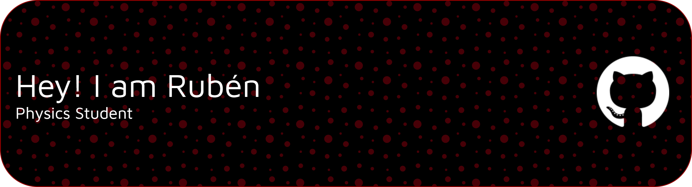

Hey yo'! I'm Rubén a physicist student, so yeah I'm one of those geeks.

🚀Graduated from the University of Cordoba. I'm from Cuenca, Spain. I'm keen on complex system, quantum mechanics and strange simulations that bend reality. I'm going to update some physics-related code. Feel free to check it out, and if you're ready, you could dive into this fascinating world and help me 🤝.
  

- 🌱 I’m currently learning: to live with curiosity.
- 🔭 I’m currently focusing on: myself. Physics, too

 

## 🛠️ Skills

#### Languages

&nbsp;

&nbsp;

#### Development
&nbsp;

#### Database

&nbsp;

#### Tools and Technologies

&nbsp;
&nbsp;

## 🤝 Connect with me

  
  
  

---

## ⚡ Top Languages

  

**Nota:** Este gráfico muestra los lenguajes más usados en tus repositorios públicos. No refleja tu nivel de experiencia, sino la proporción de código por lenguaje.

<b>Note:</b> Top languages is only a metric of the languages my public code consists of and doesn't reflect experience or skill level.

 

<table style="border: none">
  <tr>
  <td width="50%" valign="top">